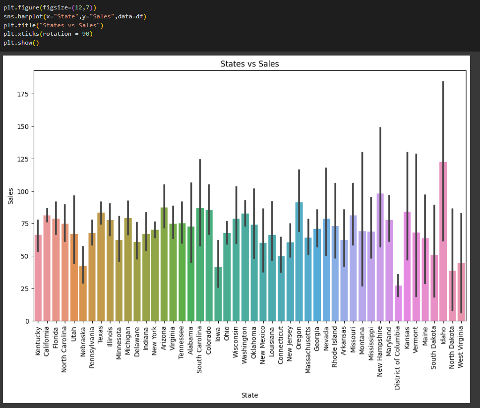

# Ex-08-Data-Visualization-

## AIM
To Perform Data Visualization on a complex dataset and save the data to a file. 

# Explanation
Data visualization is the graphical representation of information and data. By using visual elements like charts, graphs, and maps, data visualization tools provide an accessible way to see and understand trends, outliers, and patterns in data.

# ALGORITHM
### STEP 1
Read the given Data
### STEP 2
Clean the Data Set using Data Cleaning Process
### STEP 3
Apply Feature generation and selection techniques to all the features of the data set
### STEP 4
Apply data visualization techniques to identify the patterns of the data.


# CODE
```python
##Developed by: Shakthi kumar S
##Register number: 212222110043
```
## Dataset
```python
import pandas as pd
import numpy as np
import matplotlib.pyplot as plt
df=pd.read_csv("Superstore.csv",encoding='unicode_escape')
df
```
## Info 
```python
df.info()
```
## Removing unnecessary datas
```python
df.drop('Row ID',axis=1,inplace=True)
df.drop('Order ID',axis=1,inplace=True)
df.drop('Postal Code',axis=1,inplace=True)
df.drop('Product ID',axis=1,inplace=True)
df.drop('Product Name',axis=1,inplace=True)
df.drop('Order Date',axis=1,inplace=True)
df.drop('Customer ID',axis=1,inplace=True)
df.drop('Customer Name',axis=1,inplace=True)
df.drop('Country',axis=1,inplace=True)
df.drop('Ship Date',axis=1,inplace=True)
print("Updated dataset is")
df

df.isnull().sum()
```
## Removing Outliers
```python
plt.figure(figsize=(12,10))
plt.title("Data with outliers")
df.boxplot()
plt.show()

plt.figure(figsize=(12,10))
cols = ['Sales','Quantity','Discount','Profit']
Q1 = df[cols].quantile(0.25)
Q3 = df[cols].quantile(0.75)
IQR = Q3 - Q1
df = df[~((df[cols] < (Q1 - 1.5 * IQR)) |(df[cols] > (Q3 + 1.5 * IQR))).any(axis=1)]
plt.title("Dataset after removing outliers")
df.boxplot()
plt.show()
```
## Data Visualization:
### Line plot
```python
import seaborn as sns
sns.lineplot(x="Sub-Category",y="Sales",data=df,marker='o')
plt.title("Sub Categories vs Sales")
plt.xticks(rotation = 90)
plt.show()

sns.lineplot(x="Region",y="Sales",data=df,marker='o')
plt.xticks(rotation = 90)
plt.title("Region area vs Sales")
plt.show()

sns.lineplot(x="Category",y="Profit",data=df,marker='o')
plt.xticks(rotation = 90)
plt.title("Categories vs Profit")
plt.show()

sns.lineplot(x="Sub-Category",y="Quantity",data=df,marker='o')
plt.xticks(rotation = 90)
plt.title("Sub Categories vs Quantity")
plt.show()
```
### Box plot
```python
sns.barplot(x="Sub-Category",y="Sales",data=df)
plt.title("Sub Categories vs Sales")
plt.xticks(rotation = 90)
plt.show()

sns.barplot(x="Category",y="Profit",data=df)
plt.title("Categories vs Profit")
plt.show()

sns.barplot(x="Category",y="Discount",data=df)
plt.title("Categories vs Discount")
plt.show()

sns.barplot(x="Sub-Category",y="Quantity",data=df)
plt.title("Sub Categories vs Quantity")
plt.xticks(rotation = 90)
plt.show()

plt.figure(figsize=(12,7))
sns.barplot(x="State",y="Sales",data=df)
plt.title("States vs Sales")
plt.xticks(rotation = 90)
plt.show()

plt.figure(figsize=(25,8))
sns.barplot(x="State",y="Sales",hue="Region",data=df)
plt.title("State vs Sales based on Region")
plt.xticks(rotation = 90)
plt.show()
```
### Histogram
```python
sns.histplot(data = df,x = 'Category',hue='Quantity')
sns.histplot(data = df,x = 'Region',hue='Ship Mode')
sns.histplot(data = df,x = 'Sub-Category',hue='Category')
plt.xticks(rotation = 90)
plt.show()

plt.hist(data = df,x = 'Profit')
sns.histplot(data = df,x = 'Quantity',hue='Segment')
plt.show()
```
### Counter plot
```python
plt.figure(figsize=(10,7))
sns.countplot(x ='Category', data = df,hue='Discount')
sns.countplot(x ='Ship Mode', data = df,hue = 'Quantity')
sns.countplot(x ='Region', data = df,hue = 'Segment')
sns.countplot(x ='Segment', data = df,hue = 'Sub-Category')
```
### Barplot_2
```python
sns.boxplot( x="Profit", y="Category",data=df)
plt.xticks(rotation = 90)
plt.show()

sns.boxplot(x="Sub-Category",y="Discount",data=df)
plt.xticks(rotation = 90)
plt.show()

sns.boxplot(x="Category",y="Profit",data=df)
sns.boxplot(x="Region",y="Sales",data=df)
plt.figure(figsize=(10,7))
sns.boxplot(x="Sub-Category",y="Quantity",data=df)
plt.xticks(rotation = 90)
plt.show()

plt.figure(figsize=(10,7))
sns.boxplot(x="Sub-Category",y="Sales",data=df)
plt.xticks(rotation = 90)
plt.show()

sns.boxplot(x="Category",y="Discount",data=df)
plt.figure(figsize=(15,7))
sns.boxplot(x="State",y="Sales",data=df)
plt.xticks(rotation = 90)
plt.show()
```
### KDE plot
```python
sns.kdeplot(x="Profit", data = df,hue='Category')

sns.kdeplot(x="Quantity", data = df,hue='Segment')

sns.kdeplot(x="Sales", data = df,hue='Region')

sns.kdeplot(x="Discount", data = df,hue='Segment')
```
### Violin plot
```python
sns.violinplot(x="Profit",data=df)

sns.violinplot(x="Quantity",y="Ship Mode",data=df)

sns.violinplot(x="Discount",y="Ship Mode",data=df)
```
### Pointer plot
```python
sns.pointplot(x=df["Sales"],y=df["Sub-Category"])

sns.pointplot(x=df["Quantity"],y=df["Discount"])

sns.pointplot(x=df["Quantity"],y=df["Category"])
```
### Pie Chart
```python
df.groupby(['Category']).sum().plot(kind='pie', y='Discount',figsize=(6,10),pctdistance=1.7,labeldistance=1.2)

df.groupby(['Region']).sum().plot(kind='pie', y='Profit',figsize=(6,9),pctdistance=1.7,labeldistance=1.2)

df.groupby(['Sub-Category']).sum().plot(kind='pie', y='Sales',figsize=(10,10),pctdistance=1.7,labeldistance=1.2)

df.groupby(['Ship Mode']).sum().plot(kind='pie', y='Quantity',figsize=(8,11),pctdistance=1.7,labeldistance=1.2)


df1=df.groupby(by=["Category"]).sum()
labels=[]
for i in df1.index:
    labels.append(i)  
plt.figure(figsize=(8,8))
colors = sns.color_palette('pastel')
plt.pie(df1["Profit"],colors = colors,labels=labels, autopct = '%0.0f%%')
plt.show()

df1=df.groupby(by=["Ship Mode"]).sum()
labels=[]
for i in df1.index:
    labels.append(i)
colors=sns.color_palette("bright")
plt.pie(df1["Sales"],labels=labels,autopct="%0.0f%%")
plt.show()
df4=df.copy()
```
## Encoding and scaling
```python
from sklearn.preprocessing import LabelEncoder,OrdinalEncoder,OneHotEncoder
le=LabelEncoder()
ohe=OneHotEncoder
oe=OrdinalEncoder()
df4["Ship Mode"]=oe.fit_transform(df[["Ship Mode"]])
df4["Segment"]=oe.fit_transform(df[["Segment"]])
df4["City"]=le.fit_transform(df[["City"]])
df4["State"]=le.fit_transform(df[["State"]])
df4['Region'] = oe.fit_transform(df[['Region']])
df4["Category"]=oe.fit_transform(df[["Category"]])
df4["Sub-Category"]=le.fit_transform(df[["Sub-Category"]])


from sklearn.preprocessing import RobustScaler
sc=RobustScaler()
df5=pd.DataFrame(sc.fit_transform(df4),columns=['Ship Mode', 'Segment', 'City', 'State','Region',
                                               'Category','Sub-Category','Sales','Quantity','Discount','Profit'])

```
## Heatmap
```python
plt.subplots(figsize=(12,7))
sns.heatmap(df5.corr(),cmap="PuBu",annot=True)
plt.show()
```
# OUPUT
## Dataset:

## Info:

## Removed unnecessary data

## Outliers


## Line plots


## Bar plots




## Histogram


## Box plot


## KDE plot


## Violin plot


## Counter plot


## Pie charts


## Heatmap


# Result
Thus,Data Visualization is applied on the complex dataset using libraries like Seaborn and Matplotlib successfully and the data is saved to file.

